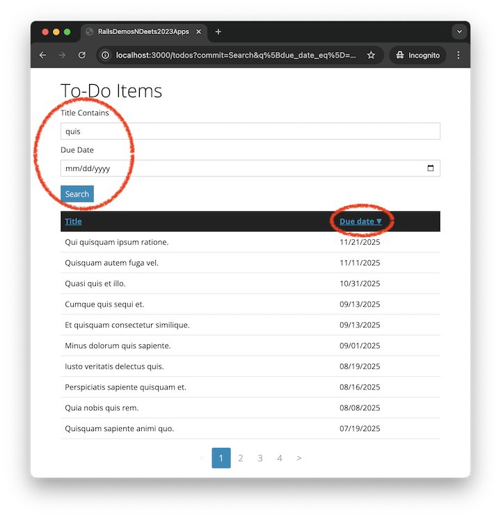

# Searching and Sorting with Ransack Demo

This demonstration shows how to use the [Ransack](https://github.com/activerecord-hackery/ransack#readme) gem to add searching and sorting to the todos index page from the [Pagination with Pagy Demo](https://github.com/human-se/demo-pagy-f24#readme).

If you would like to follow along with the video, clone this repo and switch to the `version-before-demo` branch. The `main` (default) branch holds the solution.

## Video Demo (19 minutes)

[](https://youtu.be/OInmcjheFTw?si=C2GNsf6HwQv7jRx0)

### [🎦 Watch the Video Demo](https://youtu.be/OInmcjheFTw?si=C2GNsf6HwQv7jRx0)

## Steps to Add Searching and Sorting to the Todos Index Page

- **Step 1:** In the `Gemfile`, insert `gem 'ransack'` at the bottom. Then `bundle install`.

- **Step 2:** In `app/controllers/todos_controller.rb`, in the `index` method, instantiate a Ransack `Todo` search object, sort the search results in ascending order by due date, and retrieve the search results (also apply pagination with Pagy).

```ruby
@q = Todo.ransack(params[:q])
@q.sorts = 'due_date asc' if @q.sorts.empty?
@pagy, @todos = pagy(@q.result(distinct: true), limit: 10)
```

- **Step 3:** In `app/views/todos/index.html.erb`, insert the search form above the table of todos.

```erb
<%= search_form_for @q do |f| %>
  <%= f.label :title_cont %>
  <%= f.search_field :title_cont %>

  <%= f.label :due_date_eq %>
  <%= f.search_field :due_date_eq, type: :date %>

  <%= f.submit %>
<% end %>
```

- **Step 4:** Also in the `index.html.erb` view template, make the table column heading labels into clickable links that can sort the table by the given column values.

```erb
<th><%= sort_link(@q, :title) %></th>
<th><%= sort_link(@q, :due_date) %></th>
```

- **Step 5:** In `app/models/todo.rb`, add to the `Todo` model class a class method (required by Ransack for security purposes) that returns an array of attributes that Ransack is permitted to make sortable.

```ruby
def self.ransackable_attributes(auth_object = nil)
  %w[title due_date]
end
```

- **Step 6:** Adjust the layout and style of the search form (see Bootstrap docs on [form controls](https://getbootstrap.com/docs/5.2/forms/form-control/) and [form layout](https://getbootstrap.com/docs/5.2/forms/layout/)).

```erb
<%= search_form_for @q do |f| %>
  <div class="mb-3">
    <%= f.label :title_cont, class: 'form-label form-label-sm' %>
    <%= f.search_field :title_cont, class: 'form-control form-control-sm' %>
  </div>

  <div class="mb-3">
    <%= f.label :due_date_eq, class: 'form-label  form-label-sm' %>
    <%= f.search_field :due_date_eq, type: :date, class: 'form-control form-control-sm' %>
  </div>

  <div class="mb-3">
    <%= f.submit class: 'btn btn-primary btn-sm' %>
  </div>
<% end %>
```

## Further Reading

- [Ransack Homepage](https://github.com/activerecord-hackery/ransack#readme)
- [Ransack Documentation](https://activerecord-hackery.github.io/ransack/)
